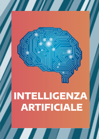
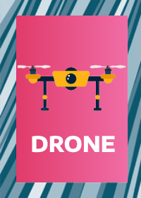

# 🧠 MEMORY 4.0

Il gioco del memory con delle carte di elementi sull'industria 4.0!

# 📜 REGOLE
Le regole sono molto semplici e basilari:
 - Si inizia premendo il pulsante in alto per mescolare le carte;
 - Ogni volta che si preme una carta bisognerà provare ad abbinarla ad un'altra sullo schermo, provando a ricordare dov'è la carta uguale;
 - Ogni volta che si sbaglia un abbinamento si perdono <b>5 punti</b>;
 - Ogni volta che un abbinamento sarà corretto si guadagnano <b>20 punti</b>.

Una volta abbinate le ultime due carte si vedrà i punti ottenuti alla fine in base a quanti errori sono stati effettuati.

# 🪄 CARTE SPECIALI
Essendo basato sull'industria 4.0 ci sono elementi sull'industria 4.0 ed alcuni di queste carte hanno degli effetti magici!

 ### 🤖 Intelligenza Artificiale
 

 Quando viene abbinata questa carta al prossimo abbinamento si avranno 3 carte evidenziate, una sola fra queste 3 è quella corretta, quale? Sta a te scoprirlo, l'intelligenza artificiale sbaglia ogni tanto ;)

 ### 🛩️ Drone
 

 Quando viene abbinata questa carta tutte le carte vengono mescolate e tutto quello che ti ricordavi fino ad adesso sarà inutile :)